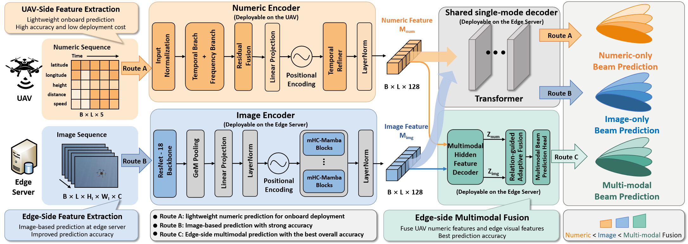

# Multimodal Data-Driven Multi-Step Beam Prediction for UAV-to-Ground mmWave Communications in Low-Altitude Networks

This folder contains the final model source code and checkpoints used in the paper. The models are designed for beam prediction on **DeepSense 6G Scenario 23**, where 10 historical observations are used to predict beam indices for the next 5 time steps.

## Highlights

- **Three deployable routes**: UAV-side numeric-only prediction, edge-side image-only prediction, and edge-side multimodal fusion.
- **Unified prediction protocol**: all branches output logits with shape `[B, 5, 64]`.
- **Modular source code**: each route has an independent entry file while sharing the same core model implementation.
- **Ready-to-load checkpoints**: checkpoint filenames are deployment-oriented and do not expose internal training epoch names.

## Dataset

The experiments use **DeepSense 6G Scenario 23**:

[https://www.deepsense6g.net/scenarios/Scenarios%2020-29/scenario-23](https://www.deepsense6g.net/scenarios/Scenarios%2020-29/scenario-23)

Each sample is a sliding input-output window:

| Item | Setting |
|---|---|
| Historical input length | 10 time steps |
| Prediction horizon | 5 time steps |
| Numeric input | `[B, 10, 5]`, including latitude/GPS, longitude/GPS, height, distance, and speed |
| Image input | `[B, 10, 3, H, W]`, RGB image sequence |
| Output logits | `[B, 5, 64]`, 64 beam classes for each future step |
| Metrics | Top-1, Top-2, Top-3, and Top-5 accuracy |

All reported experiments follow a fixed 80%/20% train-test split with random seed `42`.

## Framework

The framework contains three inference routes, as illustrated below.



*Workflow of the proposed beam prediction framework. Routes A, B, and C correspond to beam prediction based on numeric-only sequences, image-only sequences, and multimodal fusion, respectively.*

The workflow is organized around the data availability and deployment location in a UAV-to-ground mmWave communication system. Route A provides a lightweight UAV-side prediction path that only uses historical numeric states, such as GPS, height, distance, and speed. Route B uses the image sequence captured at the edge side to perform visual beam prediction when RGB observations are available. Route C further combines the numeric and visual prediction-step hidden representations through a multimodal fusion module, allowing the final predictor to exploit both UAV motion dynamics and scene-level visual cues. All three routes share the same multi-step prediction protocol and output beam logits for the next five time steps.

### Route A: UAV-side Numeric Beam Prediction

This route uses only the UAV-side numeric sequence. The numeric encoder models local temporal dynamics and low-frequency motion trends, then feeds the numeric feature into a shared single-mode decoder. This route is lightweight and suitable for onboard deployment.

### Route B: Edge-side Image Beam Prediction

This route uses the edge-side RGB image sequence. The image encoder uses a ResNet-18 backbone, GeM pooling, linear projection, positional encoding, and HMC-Mamba blocks to extract visual temporal features. It is intended for edge-side image-based prediction.

### Route C: Edge Multimodal Fusion

This route fuses numeric and image features on the edge server. Both modalities are first mapped into prediction-step hidden states. A relation-guided adaptive fusion module then models normalized discrepancy and correlation terms, constructs a no-dominant adaptive anchor, and predicts the final beam logits with a multimodal beam prediction head.

## Repository Layout

```text
.
|-- README.md
|-- assets/
|   `-- proposed_framework_overview.png
|-- code/
|   |-- __init__.py
|   |-- checkpoint_utils.py
|   |-- model.py
|   |-- model_components.py
|   |-- uav_side_numeric_beam_prediction.py
|   |-- edge_side_image_beam_prediction.py
|   `-- edge_multimodal_fusion.py
`-- weights/
    |-- uav_side_numeric_beam_prediction_ckpt.pth
    |-- edge_side_image_beam_prediction_ckpt.pth
    `-- edge_multimodal_beam_prediction_ckpt.pth
```

## Checkpoints

| Route | Entry file | Checkpoint | Training budget |
|---|---|---|---:|
| Route A | `code/uav_side_numeric_beam_prediction.py` | `weights/uav_side_numeric_beam_prediction_ckpt.pth` | 200 epochs |
| Route B | `code/edge_side_image_beam_prediction.py` | `weights/edge_side_image_beam_prediction_ckpt.pth` | 100 epochs |
| Route C | `code/edge_multimodal_fusion.py` | `weights/edge_multimodal_beam_prediction_ckpt.pth` | 50 epochs |

## Installation

The archived models were developed and tested with PyTorch, torchvision, CUDA, and `mamba_ssm`. GPU execution is recommended because the image encoder and HMC-Mamba blocks are designed for CUDA acceleration.

### Tested Environment

| Item | Version / Setting |
|---|---|
| Operating system | Windows |
| Python | 3.10.19 |
| PyTorch | 2.8.0.dev20250323+cu128 |
| torchvision | 0.22.0.dev20250324+cu128 |
| CUDA runtime used by PyTorch | 12.8 |
| mamba-ssm | 2.2.2 |
| Tested GPU | NVIDIA GeForce RTX 5070 |

Other recent CUDA-enabled PyTorch environments should also work, provided that `mamba_ssm` is installed successfully for the local CUDA/PyTorch build.

### Core Dependencies

```text
python >= 3.10
torch
torchvision
mamba-ssm
numpy
tqdm
Pillow
```

A typical conda-based setup is:

```bash
conda create -n beam_pred python=3.10
conda activate beam_pred
pip install torch torchvision
pip install mamba-ssm numpy tqdm pillow
```

If your CUDA or PyTorch version requires a specific `mamba-ssm` wheel, install `mamba-ssm` following the official package instructions for your platform. The warnings related to deprecated `torch.cuda.amp.custom_fwd/custom_bwd` APIs do not affect inference in the tested environment.

If you already use the original project environment, no additional setup is required.

## Quick Start

Add `code/` to `PYTHONPATH` or insert it into `sys.path`:

```python
import sys
from pathlib import Path

root = Path("path/to/this/folder")
sys.path.insert(0, str(root / "code"))
```

### UAV-side Numeric Beam Prediction

```python
from uav_side_numeric_beam_prediction import build_model, load_weights

model = build_model(device="cuda")
load_weights(model, map_location="cuda")
model.eval()

logits = model(numeric)  # numeric: [B, 10, 5]
```

### Edge-side Image Beam Prediction

```python
from edge_side_image_beam_prediction import build_model, load_weights

model = build_model(device="cuda")
load_weights(model, map_location="cuda")
model.eval()

logits = model(image)  # image: [B, 10, 3, H, W]
```

### Edge Multimodal Fusion

```python
from edge_multimodal_fusion import build_model, load_weights

model = build_model(device="cuda")
load_weights(model, map_location="cuda")
model.eval()

logits = model(numeric, image)
```

## Reported Results

| Route | Model | Top-1 | Top-2 | Top-3 | Top-5 |
|---|---|---:|---:|---:|---:|
| Route A | UAV-side numeric beam prediction | 0.8380 | 0.9708 | 0.9890 | 0.9961 |
| Route B | Edge-side image beam prediction | 0.9444 | 0.9869 | 0.9936 | 0.9976 |
| Route C | Edge multimodal fusion beam prediction | 0.9766 | 0.9962 | 0.9982 | 0.9994 |

## Notes

- Route A is intended for low-cost onboard UAV prediction.
- Route B is intended for edge-side image-based prediction.
- Route C provides the best overall accuracy by fusing UAV numeric features and edge visual features.
- All checkpoint files are deployment-facing archives and can be loaded directly through the route-specific entry files.
